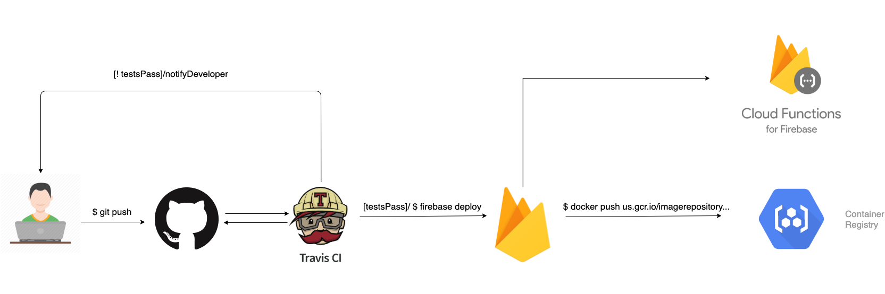

# Image Repository API
[](https://travis-ci.com/AliKhanafer7/ImageRepoAPI)

A quick thank you to Shopify for giving us this opportunity to showcase our skills. Building this was lots of fun, mainly because of the creative freedom we had!

## Table of Content
* [Small Description](#Small-Description)

* [Technology Stack](#Technology-Stack)

* [Prerequisites](#Prerequisites)

* [API Query Parameters](#API-Query-Parameters)

* [Examples](#Examples)
    * [All Images](#All-Images)
    * [One Paramter](#One-Paramter)
    * [Multiple Paramters](#Multiple-Paramters)
    * [Similar Images](#Similar-Images)
* [CI/CD](#CI/CD)

* [Contributing](#Contributing)

## Small Description
This project contains all my code for searching through an image repository based on keywords, colors, photographers and similar images.

## Technology Stack
* Firebase __Firestore__, __Storage__ and __Functions__
    * Firestore for storing image metadata
    * Storage for storing the actual image
    * Functions for serverless handeling of HTTPS requests
* Express and NodeJS to build the API
* Kubernetes for __container orchestration__
* Jest for __testing__
* Travis CI for __CI/CD__

## Prerequisites
* Your preferred method of making API calls. I suggest __Postman__ and it's what I'll be using for the examples.

## API Query Parameters
__Endpoint URI__: https://us-central1-imagerepository-b7a29.cloudfunctions.net/app/api/images

If no parameters are passed, the API will return all the images. If paramters are combined, then the `logical AND` operator is applied between the different parameters.
| Parameter        | Type            | Description                                                                                                                       | example              |
|------------------|-----------------|-----------------------------------------------------------------------------------------------------------------------------------|----------------------|
| keywords         | Array of string | Filters based on keywords provided by the photographer. Will return all images that include at least one of the keywords provided | ["mountains","cold"] |
| colors           | Array of string | Filters based on the main colors of the image. Will return all images that include at least one of the colors provided            | ["white","green"]    |
| photographerName | string          | Name of the person who took the image                                                                                             | Ali Khanafer         |
| similarImage     | string          | The ID of the image. Will look for images with the same keywords as the similarImage provided. __This paramter must be used alone and cannot be combined with other paramters__                                     | 1QU_kVr45no          |

## Examples

### All Images
```
GET /api/images
```

### One Paramter

```
GET /api/images?colors=["white","green"]
```
### Multiple Paramters
```
GET /api/images?keywords=["mountains","cold"]&colors=["white","green"]&photographerName=Ali Khanafer
```

### Similar Images
```
GET /api/images?similarImage=RvOcFSmEVOU
```

## CI/CD


## Contributing
It's important that the repository's commit history stays clean and understandable. 

Before opening any pull request, make sure you rebase interactively:
```
git rebase -i main
```
and fix any merging conflicts locally, before pushing your final changes.

Afterwards, amend your comit:
```
git commit --amend
```
and make sure your commit follows the [conventional commit](https://www.conventionalcommits.org/en/v1.0.0/) guidlines
